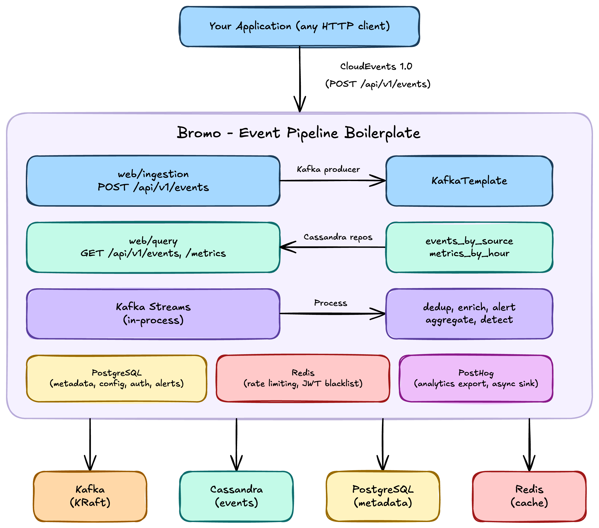

# Bromo: Event Pipeline Boilerplate

[](https://openjdk.org/projects/jdk/21/)
[](https://spring.io/projects/spring-boot)
[](https://www.graalvm.org/)
[](LICENSE)

*An event streaming pipeline boilerplate.* Send any event as CloudEvents over HTTP. It goes to Kafka, gets processed by Kafka Streams, lands in Cassandra. Query it via REST API. Export to PostHog or Webhooks.

**One deployable unit.** One Spring Boot application, one Docker image. Internally modular (domain, application, infrastructure, web). Fork it, define your own event types, wire your own processor logic, and you have a production-ready event pipeline.

*Named after Mount Bromo.* Like volcanologists measure emissions to understand a mountain, Bromo measures your application's events to make them observable.

---

## Features

- **CloudEvents-native.** CNCF standard. Define your own event types. Any source, any language.
- **Schema-agnostic.** The pipeline does not inspect your event payload. Add new types without changing infrastructure.
- **ScyllaDB ready.** Apache Cassandra is the default wide-column store. ScyllaDB works as a drop-in alternative (CQL-compatible, no code changes). See [docs/SCYLLADB.md](docs/SCYLLADB.md).
- **One deployable unit.** Single Docker image, single Helm chart (soon). Run it anywhere.
- **Apache Kafka + Kafka Streams.** Durable event backbone. In-process stream processing.
- **Cassandra for Time-series data.** Write-optimized, wide-column. Partitioned by event type and time.
- **Pluggable sinks.** Export to PostHog, webhooks, or anything. Add your own via `AnalyticsSink` interface.
- **Internally modular.** Clean architecture with domain, application, infrastructure, and web layers.
- **GraalVM native.** Optional AOT compilation. Sub-100ms startup, ~64 MB RSS.
- **Not a platform.** No UI, no proprietary SDK, no fixed schema.

---

## Quick Start

**Prerequisites:**
- Docker Engine 25+ and Docker Compose
- For local development: **JDK 21+ LTS**. The Gradle wrapper is included, no other tools required.

### Step 1: Start the infrastructure

```bash
git clone https://github.com/raihanpka/bromo-event-pipeline
cd bromo-event-pipeline
docker compose -f infra/docker/docker-compose.yml up -d
# Default wide-column store is Apache Cassandra.
# For ScyllaDB instead, add --profile scylladb.
```

This pulls and starts Kafka, Cassandra, PostgreSQL, and Redis. Wait about 60 seconds for Cassandra to finish bootstrapping.

### Step 2: Run the Bromo application

```bash
./gradlew :bromo-app:bootRun --args='--spring.profiles.active=prod'
```

The app starts on http://localhost:8080. For a containerized run, a Helm deployment, or a pre-built image, see [Deployment Options](#deployment-options).

### Step 3: Send and query events

```bash
curl -X POST http://localhost:8080/api/v1/events \
  -H "Content-Type: application/cloudevents+json" \
  -d '{
    "specversion": "1.0",
    "source": "my-app",
    "type": "com.example.completion.v1",
    "id": "evt_001",
    "time": "2026-06-19T10:30:00Z",
    "data": { "message": "hello world" }
  }'
```

Query stored events:

```bash
curl http://localhost:8080/api/v1/events?source=my-app
```

The app reads from the in-memory store or Cassandra depending on the active profile and connectivity. With the default `prod` profile, the in-memory store acts as a fallback when Cassandra is unreachable.

---

## Architecture



### Project Structure

```
bromo-event-pipeline/
├── bromo-app/                  # The application (one module)
│   ├── src/main/java/io/bromo/
│   │   ├── domain/             # Pure Java, no framework imports
│   │   ├── application/        # Use cases, no framework imports
│   │   ├── infrastructure/     # Kafka, Cassandra, PostgreSQL, Redis, export
│   │   ├── web/                # REST controllers
│   │   └── bootstrap/          # @SpringBootApplication, config
│   ├── build.gradle.kts
│   └── Dockerfile
├── bromo-core/                 # Shared library (optional, Maven Central)
├── infra/docker/               # Docker Compose (defines everything)
├── infra/helm/                 # Single Helm chart
├── benchmarks/                 # Performance data (once built)
├── build.gradle.kts
├── settings.gradle.kts
└── gradle/libs.versions.toml
```

Full architecture: [docs/ARCHITECTURE.md](docs/ARCHITECTURE.md).

---

## Deployment Options

### Docker Compose (local or VPS)

```bash
git clone https://github.com/raihanpka/bromo-event-pipeline
cd bromo-event-pipeline/infra/docker
docker compose up -d
```

One command starts Kafka, Cassandra, PostgreSQL, Redis, and the Bromo app. All images auto-pulled with this configuration.

### Pre-built Docker Image

> Soon will be pre-built Docker Hub Container or GHCR Image.

---

## Build from Source

### Prerequisites

- JDK 21+ LTS (Temurin or GraalVM recommended; system JDK builds the project, no toolchain lock-in)
- Docker Engine 25+
- (Optional) GraalVM CE 25+ for native images

### Clone and Build

```bash
git clone https://github.com/raihanpka/bromo-event-pipeline
cd bromo-event-pipeline
./gradlew build              # full build with tests
./gradlew build -x test      # fast build
```

Gradle wrapper included. No separate Gradle install needed.

### Build Docker Image

```bash
./gradlew bootBuildImage                   # JVM image
./gradlew bootBuildImage -Pnative          # Native image (GraalVM JDK required)
```

One image produced. Multi-stage Dockerfile with distroless runtime.

---

## Configuration

Environment variables for the Bromo app:

```bash
KAFKA_BOOTSTRAP_SERVERS=localhost:9092
CASSANDRA_CONTACT_POINTS=localhost:9042
SCYLLADB_CONTACT_POINTS=scylladb:9042   # only when using --profile scylladb
SPRING_PROFILES_ACTIVE=prod
POSTHOG_API_KEY=phc_xxx
POSTHOG_HOST=https://app.posthog.com
```

Full reference: [docs/CONFIGURATION.md](docs/CONFIGURATION.md).

---

## Documentation

| Link                                           | About                                    |
|------------------------------------------------|------------------------------------------|
| [docs/ARCHITECTURE.md](docs/ARCHITECTURE.md)   | Full architecture, tech stack, data flow |
| [docs/AGENTS.md](docs/AGENTS.md)               | Rules and standards for AI Agents        |
| [docs/EVENTS.md](docs/EVENTS.md)               | Event schema (define your own)           |
| [docs/CONFIGURATION.md](docs/CONFIGURATION.md) | Environment variable reference           |
| [docs/DEPLOYMENT.md](docs/DEPLOYMENT.md)       | Docker, Helm, GraalVM deployment         |
| [docs/SCYLLADB.md](docs/SCYLLADB.md)           | ScyllaDB as Cassandra alternative        |
| [benchmarks/](benchmarks)                      | Performance data (once built)            |

---

## License

[MIT License](LICENSE). The shortest license that works.