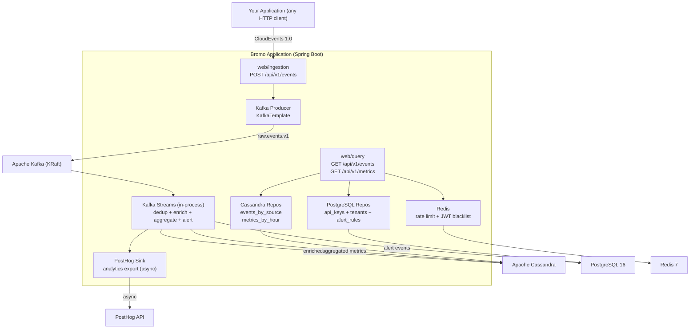

# Bromo: Event Pipeline Boilerplate

[](https://openjdk.org/projects/jdk/21/)
[](https://spring.io/projects/spring-boot)
[](https://www.graalvm.org/)
[](LICENSE)

*An event pipeline boilerplate.* Send any event as CloudEvents over HTTP. It goes to Kafka, gets processed by Kafka Streams, lands in Cassandra. Query it via REST API. Export to PostHog or Webhooks.

**One deployable unit.** One Spring Boot application, one Docker image, one Helm chart. Internally modular (domain, application, infrastructure, web). Fork it, define your own event types, wire your own processor logic, and you have a production-ready event pipeline.

*Named after Mount Bromo.* Like volcanologists measure emissions to understand a mountain, Bromo measures your application's events to make them observable.

---

## Quick Start

**Prerequisites:** Docker Engine 24+ and Docker Compose v2.

```bash
git clone https://github.com/raihanpka/bromo-event-pipeline
cd bromo-event-pipeline
docker compose -f infra/docker/docker-compose.yml up -d
```

That is it. Docker Compose pulls all images (Kafka, Cassandra, PostgreSQL, Redis from Docker Hub, Bromo from GHCR), creates the network, sets environment variables, and starts everything.

Send a test event:

```bash
curl -X POST http://localhost:8080/api/v1/events \
  -H "Content-Type: application/cloud-events+json" \
  -d '{
    "spec-version": "1.0",
    "source": "my-app",
    "type": "com.example.completion.v1",
    "id": "evt_001",
    "time": "2026-06-19T10:30:00Z",
    "data": { "message": "hello world" }
  }'
```

Query stored events:

```bash
curl http://localhost:8080/api/v1/events?source=my-app
```

Everything autoconfigures through the compose file. Kafka, Cassandra, PostgreSQL, and Redis get their default settings. Bromo discovers them via environment variables.

---

## Features

- **CloudEvents-native.** CNCF standard. Define your own event types. Any source, any language.
- **Schema-agnostic.** The pipeline does not inspect your event payload. Add new types without changing infrastructure.
- **One deployable unit.** Single Docker image, single Helm chart. Run it anywhere.
- **Kafka + Kafka Streams.** Durable event backbone. In-process stream processing.
- **Cassandra time-series.** Write-optimized, wide-column. Partitioned by event type and time.
- **Pluggable sinks.** Export to PostHog, webhooks, or anything. Add your own via `AnalyticsSink` interface.
- **Internally modular.** Clean architecture with domain, application, infrastructure, and web layers.
- **GraalVM native.** Optional AOT compilation. Sub-100ms startup, ~64 MB RSS.
- **Not a platform.** No UI, no proprietary SDK, no fixed schema.

---

## Architecture

### Data Flow



### Project Structure

```
bromo-event-pipeline/
├── bromo-app/                  # The application (one module)
│   ├── src/main/java/io/bromo/
│   │   ├── domain/             # Pure Java, no framework imports
│   │   ├── application/        # Use cases, no framework imports
│   │   ├── infrastructure/     # Kafka, Cassandra, PostgreSQL, Redis, export
│   │   ├── web/                # REST controllers
│   │   └── bootstrap/          # @SpringBootApplication, config
│   ├── build.gradle.kts
│   └── Dockerfile
├── bromo-core/                 # Shared library (optional, Maven Central)
├── infra/docker/               # Docker Compose (defines everything)
├── infra/helm/                 # Single Helm chart
├── benchmarks/                 # Performance data (once built)
├── build.gradle.kts
├── settings.gradle.kts
└── gradle/libs.versions.toml
```

Full architecture: [docs/ARCHITECTURE.md](docs/ARCHITECTURE.md).

---

## Deployment Options

### Docker Compose (local or VPS)

```bash
git clone https://github.com/raihanpka/bromo-event-pipeline
cd bromo-event-pipeline/infra/docker
docker compose up -d
```

One command starts Kafka, Cassandra, PostgreSQL, Redis, and the Bromo app. All images auto-pulled.

### Pre-built Docker Image

```bash
docker pull ghcr.io/raihanpka/bromo:bromo-app:latest

docker run -d \
  --name bromo \
  -p 8080:8080 \
  -e KAFKA_BOOTSTRAP_SERVERS=host.docker.internal:9092 \
  -e CASSANDRA_CONTACT_POINTS=host.docker.internal:9042 \
  ghcr.io/raihanpka/bromo:bromo-app:latest
```

### Kubernetes with Helm

```bash
helm install bromo ./infra/helm/bromo \
  --namespace bromo --create-namespace
```

The chart deploys the Bromo app. Infrastructure (Kafka, Cassandra) can be provided externally or added as chart dependencies.

---

## Build from Source

### Prerequisites

- JDK 21 (Temurin recommended)
- Docker Engine 24+ (for Testcontainers and infra)
- (Optional) GraalVM CE 21+ for native images

### Clone and Build

```bash
git clone https://github.com/raihanpka/bromo-event-pipeline
cd bromo-event-pipeline
./gradlew build              # full build with tests
./gradlew build -x test      # fast build
```

Gradle wrapper included. No separate Gradle install needed.

### Build Docker Image

```bash
./gradlew bootBuildImage                   # JVM image
./gradlew bootBuildImage -Pnative          # Native image (GraalVM JDK required)
```

One image produced. Multi-stage Dockerfile with distroless runtime.

---

## Configuration

Environment variables for the Bromo app:

```bash
KAFKA_BOOTSTRAP_SERVERS=localhost:9092
CASSANDRA_CONTACT_POINTS=localhost:9042
SPRING_PROFILES_ACTIVE=prod
POSTHOG_API_KEY=phc_xxx
POSTHOG_HOST=https://app.posthog.com
```

Full reference: [docs/CONFIGURATION.md](docs/CONFIGURATION.md).

---

## Documentation

| Link                                           | About                                    |
|------------------------------------------------|------------------------------------------|
| [docs/ARCHITECTURE.md](docs/ARCHITECTURE.md)   | Full architecture, tech stack, data flow |
| [docs/AGENTS.md](docs/AGENTS.md)               | Code conventions and standards           |
| [docs/EVENTS.md](docs/EVENTS.md)               | Event schema (define your own)           |
| [docs/CONFIGURATION.md](docs/CONFIGURATION.md) | Environment variable reference           |
| [docs/DEPLOYMENT.md](docs/DEPLOYMENT.md)       | Docker, Helm, GraalVM deployment         |
| [benchmarks/](benchmarks/)                     | Performance data (once built)            |

---

## License

[MIT License](LICENSE). The shortest license that works.