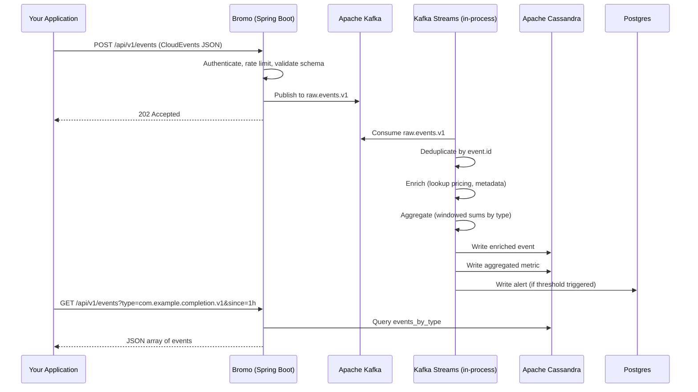

# Bromo: Architecture

This document is the canonical architecture reference. It describes the design, internal structure, technology decisions, and operational model of the Bromo event pipeline boilerplate.

---

## 1. Philosophy

- **One deployable unit.** One Spring Boot application, one Docker image. Internally modular via packages and clean architecture layers. The modularity serves code organization, not deployment topology.
- **Schema-agnostic.** The pipeline stores and processes whatever CloudEvents payload you send. Add new event types without changing infrastructure.
- **Generic, not specialized.** Bromo is a boilerplate for event-driven data pipelines. Use it for AI telemetry, business metrics, IoT sensor data, audit logs, or anything else. The example event types (completions, actions, feedback) are just examples.
- **Use the library, don't wrap the library.** Spring Kafka, Spring Data Cassandra, Spring Data JPA, and Spring Data Redis provide everything needed. Configure them, inject them, use them. Do not build abstractions on top of abstractions.

---

## 2. System Overview

Bromo is a single Spring Boot 4.x application that hosts:

- A **REST API** for event ingestion and querying
- A **Kafka producer** that publishes ingested events to the event bus
- A **Kafka Streams topology** that deduplicates, enriches, aggregates, and optionally alerts on events
- **Repository layer** connecting to Cassandra (time-series data), PostgreSQL (metadata), and Redis (rate limiting, caching)
- An **export scheduler** that forwards selected events to PostHog or webhooks

The application connects to four infrastructure services: Kafka (K-Raft mode), Cassandra, PostgreSQL, and Redis. These run as separate containers in Docker Compose or as managed services in production.

---

## 3. Internal Package Structure

```
io.bromo
├── domain/                       # Pure Java 21. Zero framework imports.
│   ├── model/                    # Records: Event, Metric, Alert, User, ApiKey
│   ├── event/                    # CloudEvents wrapper, EventType registry
│   └── repository/              # Repository interfaces (port definitions)
│
├── application/                  # Zero Spring imports.
│   ├── service/                  # IngestionService, QueryService, ExportService
│   └── port/                    # Output port interfaces (only if truly pluggable)
│
├── infrastructure/               # All framework and IO code.
│   ├── messaging/                # Kafka producer, Kafka Streams topology
│   │   ├── producer/             # EventPublisher (uses KafkaTemplate)
│   │   ├── streams/              # Topology definitions (KStream, KTable)
│   │   └── consumer/             # Alert consumer (if needed)
│   ├── persistence/              # Database adapters
│   │   ├── cassandra/            # CassandraRepository implementations
│   │   ├── postgres/             # JpaRepository implementations
│   │   └── migration/            # Flyway migrations
│   ├── cache/                    # Redis: rate limiting, JWT blacklist
│   ├── export/                   # Pluggable sinks: PostHogSink, WebhookSink
│   └── config/                   # Framework-level config beans
│
├── web/                          # REST layer
│   ├── ingestion/                # POST /api/v1/events
│   ├── query/                    # GET /api/v1/events, GET /api/v1/metrics
│   ├── admin/                    # Health, metrics, management
│   └── dto/                      # Request/response DTOs
│
└── bootstrap/                    # Application entry point
    ├── BromoApplication.java     # @SpringBootApplication
    └── config/                   # App-level configuration properties
```

### Dependency Rules

- `domain` has ZERO imports from Spring, Kafka, Cassandra, or any framework. Only Java standard library.
- `application` has ZERO imports from infrastructure or web. Only imports `domain` and standard library.
- `infrastructure` implements interfaces defined in `domain` and `application`.
- `web` depends on `application` and `domain` only.
- `bootstrap` wires everything together. It is the only place that knows about all layers.

Enforced by ArchUnit at build time.

---

## 4. Technology Stack

| Layer             | Technology                        | Why                                                      |
|-------------------|-----------------------------------|----------------------------------------------------------|
| Runtime           | Java 21 + Spring Boot 4.x         | Virtual threads, AOT, native image support               |
| Event bus         | Apache Kafka (KRaft mode)         | Single-binary, no Zookeeper, durable, replayable         |
| Time-series DB    | Apache Cassandra 5.x              | Write-optimized, wide-column, no single point of failure |
| Metadata DB       | PostgreSQL 16                     | Relational integrity. Flyway migrations.                 |
| Cache             | Redis 7                           | Rate limiting (Lua), JWT blacklist, distributed locks    |
| Stream processing | Kafka Streams (in-process)        | Runs inside the application JVM. No separate cluster.    |
| Export            | PostHog + webhook                 | PostHog for product analytics. Webhook for custom sinks. |
| Observability     | Micrometer + Prometheus + Grafana | Standard Spring Boot stack.                              |
| Native image      | GraalVM CE (optional)             | Sub-100ms startup, ~64 MB RSS.                           |

---

## 5. Data Flow



The Kafka Streams topology runs inside the Bromo JVM. No separate stream processor cluster needed.

---

## 6. Event Schema

The only requirement is CloudEvents 1.0. Your event `data` field is arbitrary JSON.

**Required attributes:** `specversion`, `id`, `source`, `type`, `time`.

**Example types shipped** (replace with your own):

| Type                        | Purpose                  |
|-----------------------------|--------------------------|
| `com.example.completion.v1` | LLM completion example   |
| `com.example.action.v1`     | Any action event example |
| `com.example.feedback.v1`   | User feedback example    |

Add new types by sending events with a new `type` value and adding a Cassandra table or reusing the generic `events_by_source` table. See [../EVENTS.md](../EVENTS.md).

---

## 7. Persistence Model

### 7.1 Cassandra (Time-Series)

| Table              | Partition Key                   | Purpose                        |
|--------------------|---------------------------------|--------------------------------|
| `events_by_type`   | (type, date_bucket)             | Query events by type per day   |
| `events_by_source` | (source, date_bucket)           | Query events by source per day |
| `metrics_by_hour`  | (type, metric_name, year_month) | Pre-aggregated hourly metrics  |

Default TTL: 90 days. All queries use prepared statements.

### 7.2 PostgreSQL (Metadata)

| Schema         | Tables                      | Purpose          |
|----------------|-----------------------------|------------------|
| `bromo_auth`   | api_keys, tenants           | Authentication   |
| `bromo_config` | alert_rules, pricing_models | Configuration    |
| `bromo_alerts` | alert_events                | Triggered alerts |

Flyway migrations. One schema per concern.

### 7.3 Redis

TTL-based: rate limit counters (Lua), JWT blacklist, hot cache.

---

## 8. Deployment

### 8.1 Docker Compose (Local or VPS)

`infra/docker/docker-compose.yml` defines Kafka, Cassandra, PostgreSQL, Redis, and the Bromo app. One command starts everything:

```bash
docker compose -f infra/docker/docker-compose.yml up -d
```

Docker Compose pulls all images. Environment variables connect the Bromo app to the infrastructure.

### 8.2 Pre-built Docker Image

Published to GHCR:

```bash
docker pull ghcr.io/raihanpka/bromo:bromo-app:latest
```

### 8.3 Kubernetes (Helm)

The Helm chart at `infra/helm/bromo/` deploys the Bromo app. Configure infrastructure endpoints via values.yaml.

```bash
helm install bromo ./infra/helm/bromo --namespace bromo --create-namespace
```

### 8.4 Resource Profile

| Component     | JVM           | Native          |
|---------------|---------------|-----------------|
| Bromo app     | 256-512 MB    | 64-128 MB       |
| Kafka (KRaft) | 512 MB        | --              |
| Cassandra     | 512 MB        | --              |
| PostgreSQL    | 256 MB        | --              |
| Redis         | 128 MB        | --              |
| **Total**     | **~1.7-2 GB** | **~1.1-1.5 GB** |

---

## 9 Technology Stack

| Concern      | Choice                                        |
|--------------|-----------------------------------------------|
| Language     | Java 21                                       |
| Framework    | Spring Boot 4.x                               |
| Build        | Gradle (convention plugins + version catalog) |
| Code style   | Google Java Style Guide (Spotless)            |
| Architecture | COLA (Alibaba) + Clean Architecture layers    |
| API          | Spring WebMVC + Springdoc OpenAPI             |
| Kafka        | Spring Kafka + Kafka Streams (in-process)     |
| Cassandra    | Spring Data Cassandra                         |
| PostgreSQL   | Spring Data JPA + Flyway                      |
| Redis        | Spring Data Redis                             |
| Metrics      | Micrometer + Prometheus                       |
| Tracing      | Micrometer Tracing + OpenTelemetry            |
| Export       | PostHog API + pluggable sink interface        |
| Container    | Paketo Buildpacks / multi-stage Dockerfile    |
| Native       | GraalVM CE (optional, `-Pnative`)             |
| Quality      | Spotless + ArchUnit + JaCoCo                  |

---

## 10. API Endpoints

| Method | Path                 | Purpose                                                             |
|--------|----------------------|---------------------------------------------------------------------|
| POST   | /api/v1/events       | Ingest a CloudEvents payload                                        |
| GET    | /api/v1/events       | Query events (query params: type, source, since, until, limit)      |
| GET    | /api/v1/metrics      | Query aggregated metrics (query params: type, metric, since, until) |
| GET    | /actuator/health     | Health check                                                        |
| GET    | /actuator/prometheus | Prometheus metrics                                                  |

---

## 11. Security

- **API key authentication** on the ingestion endpoint. Keys hashed with Bcrypt.
- **Rate limiting** per API key (sliding window via Redis Lua).
- **TLS** in production. Self-signed for dev, cert-manager for K8s.
- **Secrets** via Docker secrets or Kubernetes Secrets. Never in environment variables in production.

---

## 12. Performance Targets

*No benchmarks have been run. These are targets for the 1.0 release.*

| Metric                                | Target           |
|---------------------------------------|------------------|
| Ingestion throughput                  | 5,000 events/sec |
| E2E latency (ingest to Cassandra) p95 | 500 ms           |
| Query p50                             | 50 ms            |
| Query p99                             | 200 ms           |
| Memory (JVM)                          | 256-512 MB       |
| Memory (native)                       | 64-128 MB        |
| Startup (JVM)                         | 3-5 sec          |
| Startup (native)                      | 50-100 ms        |

---

## 13. Testing

| Layer        | Tool                                                 | Scope                        |
|--------------|------------------------------------------------------|------------------------------|
| Unit         | JUnit 5                                              | Domain and application logic |
| Integration  | Testcontainers (Kafka, Cassandra, PostgreSQL, Redis) | Full event lifecycle         |
| Architecture | ArchUnit                                             | Package dependency rules     |
| Load         | k6                                                   | Throughput and latency       |

## 14. Observability

Every request produces: structured JSON log (traceId, spanId), Micrometer metrics (counter, timer, histogram), and an OpenTelemetry span. Pre-built Grafana dashboard for pipeline health.

## 15. Development

```bash
./gradlew build              # Full build + tests + checks
./gradlew build -x test      # Fast build
./gradlew test               # Run tests
./gradlew check              # Spotless + ArchUnit
./gradlew nativeCompile      # Native image (GraalVM)
./gradlew bootBuildImage     # Docker image
```
